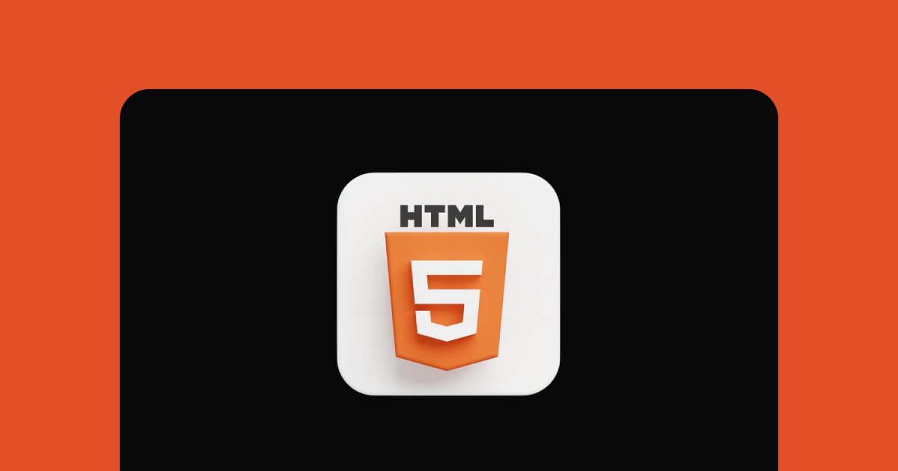

<h1 align="center"> Desafio HTML </h1>

Desafios propostos pela Rocket Seat para aperfeiçoar os conhecimentos obtidos durante curso Discover.</a>

  

 

## 🚀 Tecnologias

Esse projeto foi desenvolvido com a seguinte tecnologia:

- HTML

## 💻 Projeto

1- Glossário
2- Formulário de contato
3- Lista de compras
4- Quiz
5- Blog Post
